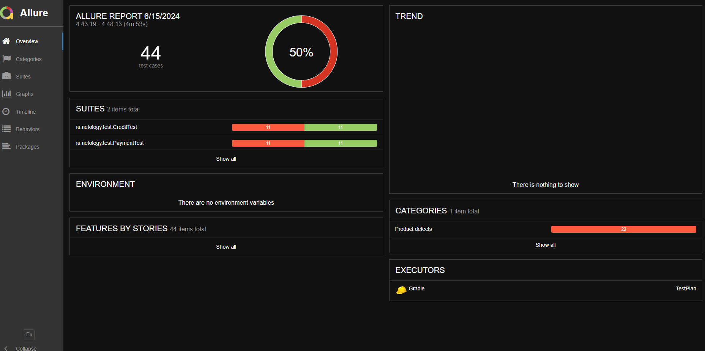
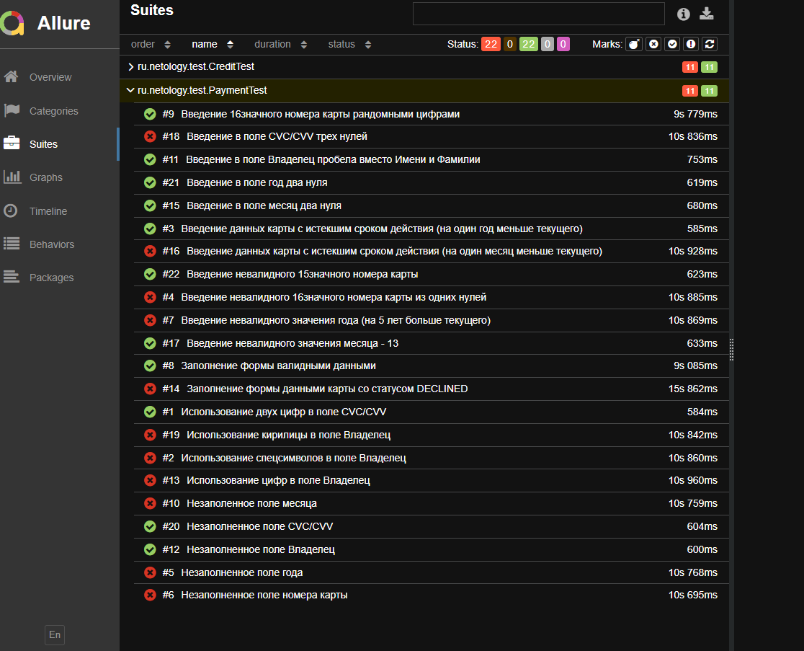
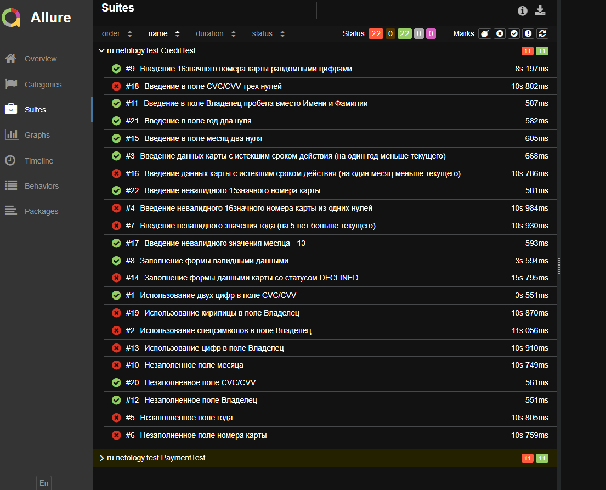

### Отчет по итогам тестирования

#### Краткое описание

Протестировали веб-сервис, позволяющий купить тур по определённой цене двумя способами:

1. Обычная оплата по дебетовой карте
2. Выдача кредита по данным банковской карты

Проверили работу сервиса с двумя СУБД:MySQL, PostgreSQL

#### Количество тест-кейсов

Было реализовано 44 автотестов:

22 для тестирования сервиса Payment Page
22 для тестирования сервиса Credit Page

#### Процент успешных и не успешных тест-кейсов
По итогам тестирования 50% тестов прошли успешно

#### Общие рекомендации

1. Реализовать валидацию полей в форме приложения
2. Провести проверку отправленных данных в банк